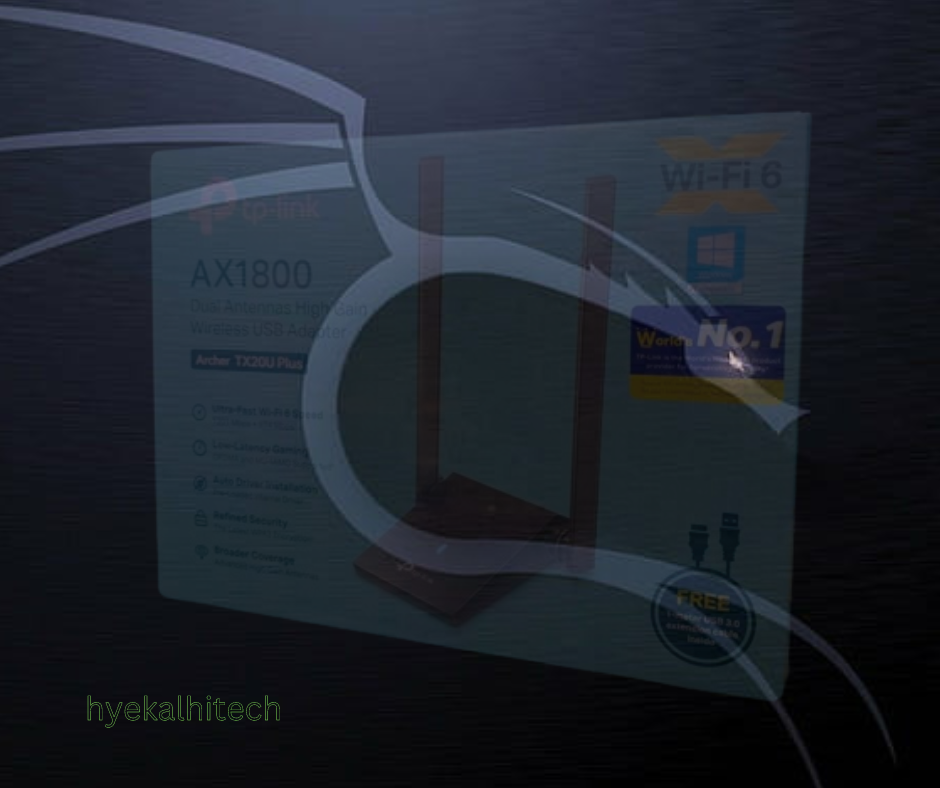

# ArcherRTL8832AU
==================

TP Link Archer TX20 Plus (Wifi 6) Driver and added custom patch to make it work on latest Linux distro. 

# TP Link Archer TX20U Plus AX1800
==================================



[](LICENSE)
[](https://github.com/hyekalhitech/ArcherRTL8832AU/stargazers)
[](https://github.com/hyekalhitech/ArcherRTL8832AU/network/members)
[](https://github.com/hyekalhitech/ArcherRTL8832AU/issues)
[](https://github.com/hyekalhitech/ArcherRTL8832AU/pulls)

## Table of Contents
- [ArcherRTL8832AU](#archerrtl8832au)
- [TP Link Archer TX20U Plus AX1800](#tp-link-archer-tx20u-plus-ax1800)
  - [Table of Contents](#table-of-contents)
  - [Introduction](#introduction)
  - [Special Thanks To the Developer and the contributor who ACTUALLY make this works !](#special-thanks-to-the-developer-and-the-contributor-who-actually-make-this-works-)
  - [Installation Guide](#installation-guide)
  - [Tested Distro](#tested-distro)
  - [Known Issues](#known-issues)
  - [License](#license)
  - [Acknowledgments](#acknowledgments)
  - [Updated on 05/01/2024](#updated-on-05012024)

## Introduction

TP Link Archer TX20 Plus (Wifi 6) use Realtek 8832AU Chipset which is NOT a In-Linux Driver supported in the latest Linux Kernel. In order to make it work, we have to use an another driver which is NOT the 8832AU but its worked on the most Linux systems.

## Special Thanks To the Developer and the contributor who ACTUALLY make this works !

- **<a href="https://github.com/lwfinger">lwfinger</a></p>**   : For Creating The Driver On Linux
- **<a href="https://github.com/dovandung">dovandung</a></p>** : For Sharing the line code that need to change (To make Injection mode Working!).
- **<a href="https://github.com/JeCuRoz">JeCuRoz</a></p>**     : For sharing the injection code patch !

## Installation Guide

**Step 1** 
Update & Install

Requirements
You will need to install "make", "gcc", "kernel headers", "kernel build essentials", and "git".

Clone the repository:

   ```bash
   sudo apt-get upgrade
   sudo apt-get install make gcc linux-headers-$(uname -r) build-essential git
   ```

If any of the packages above are not found check if your distro installs them like that.

**Step 2**
Downloading the driver

For all distros:

```bash
git clone https://github.com/lwfinger/rtl8852au.git
```

**Step 3**
Downloading the patch (Packet Injection is working)

```bash
git clone https://github.com/hyekalhitech/ArcherRTL8832AU.git
```

**Step 4**
Rename the patch file.
If you're already download the patch file, you may notice that got 2 different file in there, you have to rename the files by removing the "patch_"

1. patch_drv_conf.h
2. patch_rtw_xmit.c

Rename to :-

1. drv_conf.h
2. rtw_xmit.c

**Step 5**
Move the patch files into the downloaded driver directory.

```bash
mv drv_conf.h /rtl8852au/include/
mv rtw_xmit.c /rtl8852au/core/
```
**Step 6**
Build & Install the driver

When a USB device is plugged in, or detected at boot, this rule causes the utulity
usb_modeswitch to unload any 0bda:1a2b devices that it finds. If you have a
device with different ID, change the rule accordingly.

The build this driver, do the following:

For all distros:
```bash
git clone https://github.com/lwfinger/rtl8852au.git
cd rtl8852au
make
sudo make install

When you get a new kernel, you will need to rebuild the driver. Do the following:
cd rtl8852au
git pull
make
sudo make install
```
**Step 7**
Unplug and plug back the TP-Link device (For Live Usb) OR Reboot (Installed Host)

**Step 8**
Check the interface.
```bash
sudo airmon-ng
```
**Step 9**
Test monitor mode
```bash
sudo airmon-ng start <interfacename>
```

**Step 10**
Test packet injection
```bash
sudo aireplay-ng --test <interfacename>
```
## Tested Distro

- Kali Linux (2023.4)
- Parrot Security Edition
- BlackArch

## Known Issues
- Turning on/off monitor mode many times in a short period will make the system freeze. Still figure it out why, when its freeze, you have to force restart the PC/Laptop.

## License

refer to the [LICENSE](LICENSE) file.

## Acknowledgments

I would like to thank you to the developer and the contributors for sharing their valuable knowledge and sharing the info.

## Updated on 05/01/2024 ##